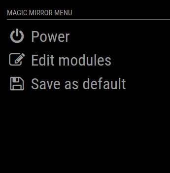

# Magic Mirror Module: Remote Control

This module for the [Magic Mirror²](https://github.com/MichMich/MagicMirror) allows you to quickly shutdown your mirror through a web browser.
The website should work fine on any device (desktop, smart phone, tablet, ...).
Since we all want our [SD cards to live a long and prosper life](http://raspberrypi.stackexchange.com/a/383) we properly shut down before pulling the power plug everytime, am I right?
Additionally you can hide and show modules on your mirror.




## Installation

- (1) Clone this repository in your `MagicMirror/modules` folder:
```bash
git clone https://github.com/Jopyth/MMM-Remote-Control.git
```

- (2) Add the module to your `config/config.js` file, if you add a `position`, it will display the URL to the remote on the mirror.
```javascript
{
    module: 'MMM-Remote-Control'
    // uncomment the following line to show the URL of the remote control on the mirror
    // , position: 'bottom_left'
    // you can hide this module afterwards from the remote control itself
},
```

- (3) Access the remote interface on [http://192.168.xxx.xxx:8080/remote.html](http://192.168.xxx.xxx:8080/remote.html).

- (4) If you are not running with `sudo` rights, the shutdown does not work (it *should* work for everyone who did not change anything on this matter).

## Update

Update this module by navigating into its folder on the command line and executing this command: `git pull`.

## Call methods from other modules

You can call any of the methods provided in the UI directly through a GET request, or a module notification.
For example you can use [MMM-ModuleScheduler](https://forum.magicmirror.builders/topic/691/mmm-modulescheduler) to automatically shutdown your RasberryPi at a certain time, or integrate it with home automation systems.

### Examples

- Example for a GET request to trigger a RaspberryPi restart:
```
http://192.168.xxx.xxx:8080/remote?action=RESTART
```

- Example for a notification schedule for [MMM-ModuleScheduler](https://forum.magicmirror.builders/topic/691/mmm-modulescheduler) to automatically switch your monitor on and off with :
```javascript
notification_schedule: [
    {notification: 'REMOTE_ACTION', schedule: '30 9 * * *', payload: {action: 'MONITOROFF'}},
    {notification: 'REMOTE_ACTION', schedule: '30 18 * * *', payload: {action: 'MONITORON'}}
]
```

- Example to trigger a RaspberryPi restart in your module:
```
this.sendNotification('REMOTE_ACTION', {action: 'RESTART'});
```

### List of actions

| action | description |
| ------------- | ------------- |
| SHUTDOWN | Shutdown your RaspberryPi |
| REBOOT | Restart your RaspberryPi |
| RESTART | Restart your MagicMirror |
| MONITORON | Switch your display on |
| MONITOROFF | Switch your display off |
| SAVE | Save the current configuration (show and hide status of modules), will be applied after the mirror starts |
| HIDE | (Not recommended, simply hide the module directly) hide a module, with the identifier specified by `module` |
| SHOW | (Not recommended, simply show the module directly) show a module, with the identifier specified by `module` |

## License

The MIT License (MIT)
=====================

Copyright © 2016 Joseph Bethge

Permission is hereby granted, free of charge, to any person
obtaining a copy of this software and associated documentation
files (the “Software”), to deal in the Software without
restriction, including without limitation the rights to use,
copy, modify, merge, publish, distribute, sublicense, and/or sell
copies of the Software, and to permit persons to whom the
Software is furnished to do so, subject to the following
conditions:

The above copyright notice and this permission notice shall be
included in all copies or substantial portions of the Software.

**The software is provided “as is”, without warranty of any kind, express or implied, including but not limited to the warranties of merchantability, fitness for a particular purpose and noninfringement. In no event shall the authors or copyright holders be liable for any claim, damages or other liability, whether in an action of contract, tort or otherwise, arising from, out of or in connection with the software or the use or other dealings in the software.**
